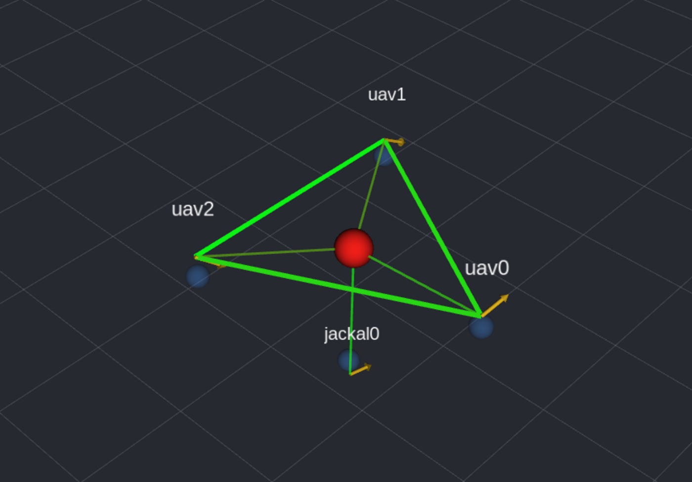
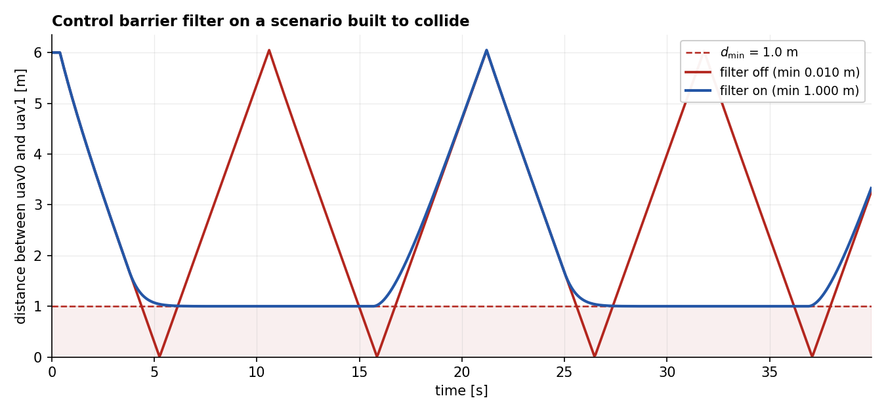
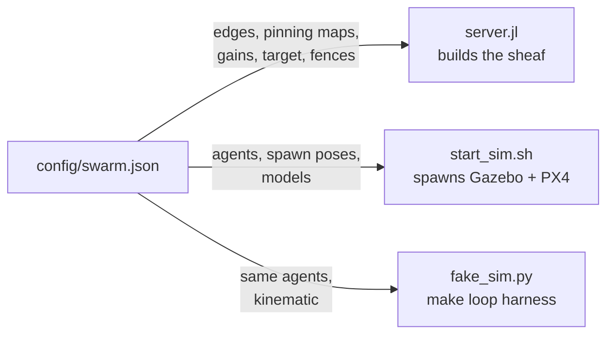
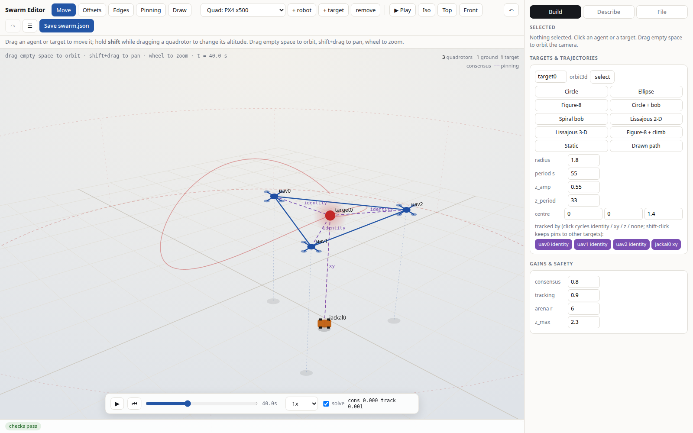
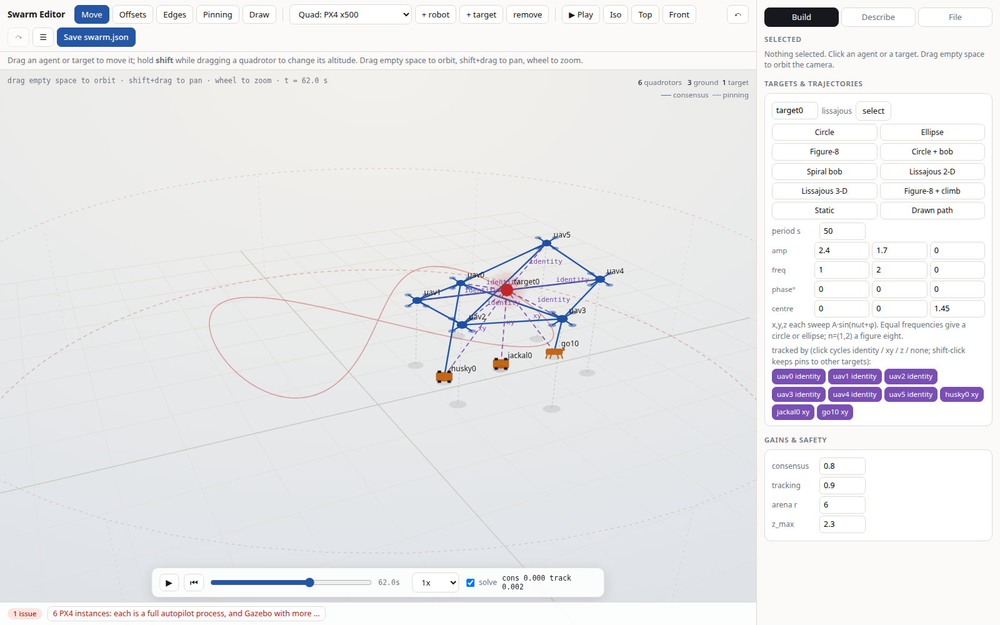
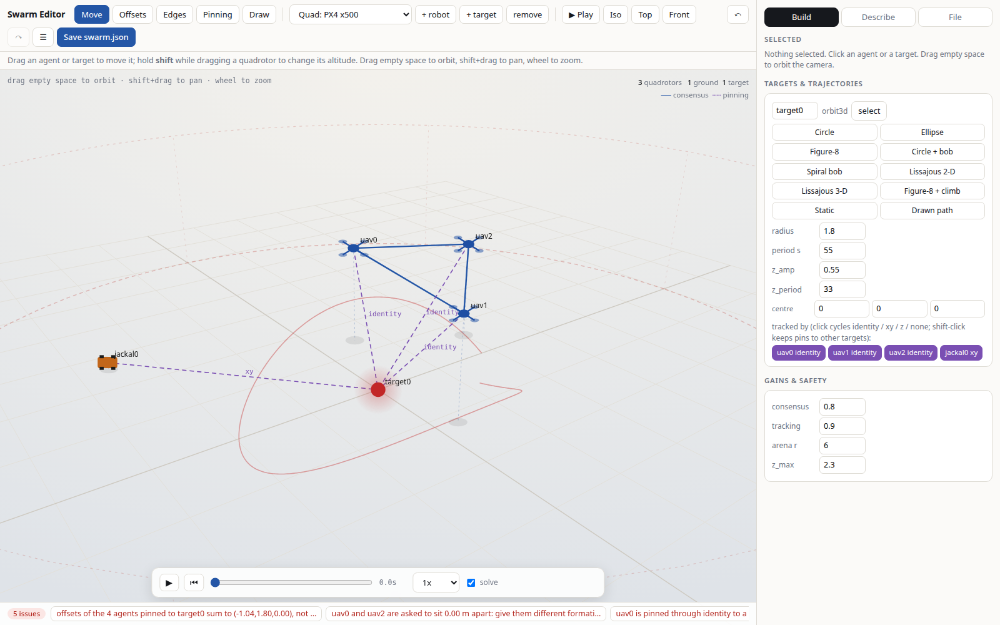
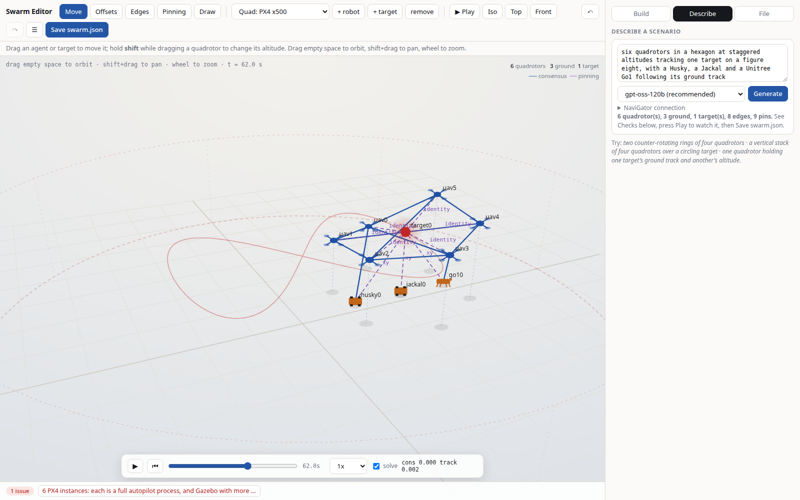
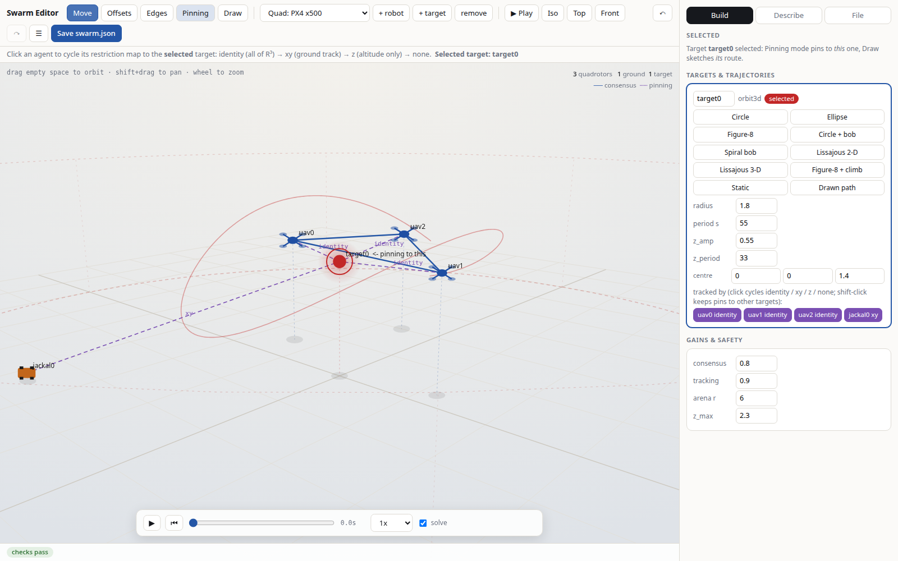

# Autonomy Park: sheaf control over ROS 2 and Gazebo

A heterogeneous air/ground swarm driven by a cellular-sheaf controller. The
controller stays in Julia and speaks to the robots over ZMQ; ROS 2 carries only
robot traffic. The stack is pinned to what the UF Autonomy Park documents:
Ubuntu 22.04 Jammy, ROS 2 Humble, Gazebo Harmonic (`gz-harmonic`), PX4 SITL
(`gz_x500`), MAVROS, QGroundControl.

```
       Gazebo Harmonic                          Julia
  ┌───────────────────────┐              ┌──────────────────┐
  │ 3x PX4 x500 (SITL)    │              │   server.jl      │
  │ 1x diff-drive ground  │              │  sheaf Laplacian │
  └───────────┬───────────┘              │  + geofence      │
   MAVLink    │   gz transport           └────────┬─────────┘
  ┌───────────▼───────────┐                       │ ZMQ REQ/REP
  │ mavros  |  ros_gz     │                       │ protocol v2
  └───────────┬───────────┘                       │
              │  ROS 2 topics                     │
        ┌─────▼──────────────────────────────┐    │
        │ sheaf_bridge  (rclpy)              ├────┘
        │  state in -> velocities out        │
        │  watchdog: no reply => all stop    │
        └────────────────────────────────────┘
```



*What the controller thinks, drawn by `make rviz` while the stack runs: thick
green consensus edges holding the triangle, thin pinning edges to the target,
orange arrows for each commanded velocity, and the rover coupled through the
ground plane alone. Edges are coloured by residual, so an agent cut from the
active subcomplex has its edges visibly vanish.*

## What the sheaf is doing

Vertices are the four agents plus one target. Edges are a triangle among the
quadrotors, one quadrotor-to-ground edge, and one pinning edge from `uav0` to the
orbiting target. The heterogeneity lives entirely in the restriction maps:

| edge | restriction maps | meaning |
|---|---|---|
| air-air | identity on ℝ³ | agree in full 3-D |
| air-ground | `PROJECT_XY` on both ends | agree about position over the ground only |
| pinning | identity | track the target |

The air-ground edge is the point. Asking a ground robot to match a quadrotor's
altitude would make the sheaf admit no global section at all; restricting that
edge to the shared x-y coordinates is what makes a mixed-altitude formation a
well-posed consensus problem rather than an infeasible one.

The control law is the sheaf Laplacian gradient flow plus the target's velocity
as feedforward, with consensus and pinning carried by separate coboundaries so
they take independent gains:

```
u_i = v_target - k_c (δ_c' δ_c z)_i - k_t (δ_p' δ_p z)_i,   z_i = p_i - o_i
```

`o_i` is a per-agent formation offset, so the global section is a rigid formation
about the target rather than a rendezvous at a point. The feedforward matters:
the equilibrium section translates with the target, so without it a proportional
law trails by an offset set by each platform's inner-loop lag -- which distorts
the formation *shape*, since the lags differ. With it, the gradient only rejects
disturbance, which is also why the gains are sized small (k·λ_max(L) must clear
~0.5 s of PX4 velocity-loop latency; at twice these gains the swarm limit-cycled
at a 2.3 s period).

The coboundaries are built over the **active subgraph** only: an agent joins the
sheaf when its bridge reports it ready (armed, offboard, climbed, fresh state)
and its estimate is plausible for this arena, with a short join debounce; it is
cut instantly otherwise. A grounded vehicle with a drifting EKF exerting
consensus force on the flying ones was the single most damaging failure mode
observed -- the active sheaf is the subcomplex of live agents, and vertices
rejoin edges-and-all when they recover.

### The safety filter



*Both runs are `config/collide.json`, two quadrotors pinned to targets that
cross the arena in phase; the only difference is `SHEAF_CBF`. Without the filter
the pair passes through each other four times, closing to 0.0096 m. With it the
distance flattens onto the 1.0 m barrier and slides along it. Regenerate with
`scripts/plot_cbf.py`.*


A global section is an agreement about geometry, not a guarantee about
collisions: two agents converging on their slots from opposite sides pass
through the same air on the way, and the gradient flow has no opinion about it.
So the command leaves `sheaf_control` through a control-barrier-function filter,
sitting between the sheaf gradient and the platform limits.

For every pair of active agents,

```
h_ij(p) = ‖S_ij (p_i − p_j)‖² − d_ij² ≥ 0,     ḣ_ij ≥ −α h_ij
```

with `S_ij` the identity for an air-air pair and `PROJECT_XY` for any pair
involving a rover: the same restriction map the mixed-kind consensus edges
carry, for the same reason. A quadrotor at 1.4 m and a rover share only the
ground plane, and scoring that pair in ℝ³ would leave the shipped scenario
permanently unsafe on paper (the rover flies 1.2 m horizontally from each
quadrotor and 1.3 m below) so the filter would be always on and always fighting
the controller.

The controller is a velocity-level one, so from the filter's point of view every
agent is a single integrator `ṗ = u` and the barrier condition is *linear* in the
command:

```
2 (S_ij Δp)ᵀ S_ij (u_i − u_j) ≥ −α h_ij
```

The filter is then the smallest correction satisfying all of them at once,

```
min_u  Σ_i ‖u_i − u_nom,i‖²   s.t.  C u ≥ b
```

solved in the dual, where it is a nonnegativity-constrained QP that Hildreth's
cyclic coordinate descent (Hildreth 1957) handles in closed form per coordinate:
every iterate is dual feasible and the objective decreases monotonically, so the
sweep cap is a bound on cost rather than a cliff. `G = C Cᵀ` is at most one row
per pair (six for these four agents), and the whole solve is a few hundred flops.

Radii and α come from `safety.min_separation` in the config, with defaults when
the block is absent. Unlike `examples/RL/lib/cbf_ipm.jl`, which splits each
pair's responsibility in half so each agent can solve its own filter onboard,
this server already holds every command and solves the joint problem: same safe
set, no conservatism from the split, and no deadlock-breaking bias to tune. The
per-agent split is what the decentralized phase will use, and the constraint rows
are already in that form.

It degrades rather than throwing. If a row still fails after the solve, because
agents are already well inside `d_min` with conflicting escape directions or
because the sweep cap was reached, that pair is pushed apart along its own
separating axis at a rate proportional to how far inside it is. Two agents at the
same point are the one genuinely infeasible case (the barrier gradient vanishes,
so no command satisfies the constraint); they get the same repulsion along the
axis their formation offsets ask for. Not minimally invasive, unambiguously in
the safe direction, and the alternative in a control loop is an exception and a
swarm with no commands at all.

#### Keep-out zones

Agents are not the only thing to stay away from. At the park there is a pilot
area, a net, a pillar, a landing pad nobody wants overflown. `safety.keep_out`
is an optional list of static volumes, and every one of them becomes rows in the
same QP:

```json
"keep_out": [
  { "name": "pillar", "kind": "cylinder", "center": [1.5, -2.0, 0.0],
    "radius": 0.9, "height": 2.5, "applies": "all" },
  { "name": "net", "kind": "sphere", "center": [0.0, 3.0, 1.2],
    "radius": 1.1, "applies": "air" }
]
```

The barrier has the same shape as the pairwise one with the second agent
replaced by fixed geometry, so a zone is static and only the one agent's command
appears in its row:

```
h_iz(p) = ‖S_z (p_i − c_z)‖² − r_z² ≥ 0,      2 (S_z (p_i − c_z))ᵀ S_z u_i ≥ −α h_iz
```

`S_z` is the identity for a `sphere`, measured in ℝ³, and `PROJECT_XY` for a
`cylinder`, a vertical column measured on horizontal distance that constrains an
agent only while its altitude lies inside `[center_z, center_z + height]`. The
column is the form the park actually needs: a pillar, a net stand or a light
mast is an obstacle at the height it occupies and open air above it. Scoring one
in ℝ³ would either fence off the airspace over it or, sized to leave that
airspace usable, let a rover drive through its base.

`applies` picks which platforms a zone constrains: `"all"`, `"air"` or
`"ground"`. A pillar matters to everything; the net and the pilot area matter to
a quadrotor; a landing pad you do not want overflown matters only to the air,
where fencing the rover out of it would be a bug rather than caution.

A column's row switches on and off as an agent crosses the ends of its z span,
with 0.25 m of pad added at each end. The pad is not there to break a feedback
loop, because there is none to break: the row's gradient has no z component, so
its correction is purely horizontal and can never move an agent back across the
boundary that switched it on. What the pad buys is that the one discontinuity
left, the horizontal command stepping as an agent climbs out of the span under
some other command, happens 0.25 m clear of the obstacle instead of exactly at
its lip. It also makes every column slightly taller than declared, which is the
safe direction to be wrong about an obstacle.

Zone rows join the same `C u ≥ b` as the pairwise ones rather than a second pass
afterwards. A robot squeezed between a neighbour and a wall is then one
optimization with both rows in it and gets one consistent answer, where two
filters in sequence each undo part of the other's correction.

Degradation matches the pairwise case. An agent already inside a zone has
`h < 0`, and if the solve cannot satisfy its row it is pushed along that row's
own gradient, which for a zone is exactly the outward normal, at a rate
proportional to how far inside it is. An agent dead on a sphere's centre or a
column's axis is the one case with no normal to read off the geometry; it leaves
along the horizontal direction from the arena origin to the zone centre, which
is deterministic and points out of the middle of the field.

`safety.keep_out` is absent from `config/swarm.json`, which therefore builds no
zone rows and runs exactly as it did. `config/keepout.json` is the scenario
built to need them; see below.

#### Agents that are present but not active

An agent this controller will not command is still a solid object. A quadrotor
climbing to its slot altitude under its adapter's own control, one that failed
preflight, one whose mocap dropped a beat ago: none of them takes a command from
`sheaf_control`, and every one of them is in the way.

So the filter also builds a row between each *active* agent and each agent whose
reported position this tick is fresh and inside the trust band, active or not.
Those rows are one-sided: same barrier, same radii, but only the active agent's
command appears in them, because we have no say in what the other one does. Its
own motion is unmodelled for the same reason we declined to trust its state,
which is part of why the radii carry margin over the vehicle footprints.

What is still not constrained is a position we do not believe. An estimate
outside the trust band is a crashed vehicle dead-reckoning at thousands of
metres, or a grounded one whose EKF drifted, and steering live agents around a
ghost is how a bad estimate takes down the swarm.

#### Synchronized start

`safety.synchronized_start`, on by default, holds every command at zero until
every configured agent has joined the active sheaf.

The default is on because of what the platforms do before they are active.
`Px4Adapter.send` flies its own climb to `z_ref` and ignores the command it is
given until it is up, and while it climbs the server has it inactive. An agent
already at slot altitude therefore crosses the airspace of a climbing one whose
motion this controller neither commands nor predicts. Fleet arming is staggered
by seconds, so that window is not a corner case, it is every takeoff.

The gate does not stop the climbs. They happen in each vehicle's own column from
spawn points that are already separated, which is safe by construction. It stops
*translation*, the part that needs the other robots to exist.

It latches. The gate opens once, on the first tick the whole swarm is active,
and never closes again. Re-arming it on a later dropout would freeze the
formation mid-flight every time one agent blipped out of the active set, which
is worse than the problem being solved. After the start a dropout is handled
where it belongs: the dropped agent is commanded zero, leaves the coboundaries,
and stays in the barrier as an obstacle by the rows above.

An agent that never becomes ready must not hold the rest of the swarm forever.
Waiting indefinitely sounds like the safe reading and it is not: observed in
Gazebo, one quadrotor passed preflight, was later refused arming for a health
failure and exited, and the gate then held every other agent and the rover at
zero command for the whole session. The only thing still moving was the adapters'
own climb, so the operator saw a swarm that sat there and did not track at all,
caused by a vehicle that had removed itself. A member missing at takeoff is the
normal case on a fleet, not an exception.

So the gate also opens on a timeout, `safety.start_timeout` seconds after the
first tick (45 s by default, well past a staggered arming and climb), with
whoever is active at that moment, naming who it gave up on:

```
Warning: starting without uav1: not ready after 45 s.
         They stay uncommanded and are avoided as obstacles.
```

Those agents are still not commanded, and they are still in the barrier as
obstacles, so starting without them is not the same as ignoring them. Set
`start_timeout` to zero to wait forever, which is a deliberate operator choice
rather than the default. The diagnostics name who is being waited on every tick,
and `synchronized_start: false` skips the gate entirely.

#### Diagnostics

The diagnostics carry `cbf_active` (rows with a nonzero multiplier),
`cbf_constraints`, `cbf_fallback` and `min_separation` / `min_margin` in the
pairs' own metrics; `cbf_zone_constraints`, `cbf_zone_active` and
`min_zone_margin` for the keep-out rows (the margin is signed, negative inside a
zone, and reads `-1.0` when no zone row existed, which `cbf_zone_constraints = 0`
tells you apart); `cbf_obstacle_rows` for the one-sided rows against
present-but-inactive agents; and `started` / `waiting_for` for the start gate. The
RViz overlay and `scripts/fake_sim.py` both report them. `SHEAF_CBF=0` removes
the filter, which is how the numbers below were measured.

## The scenario is one file

`config/swarm.json` declares the whole experiment: which robots exist, where
they spawn, the sheaf (edges + restriction maps), the target, the gains, the
fences. Three independent programs read it, so editing it reconfigures the
mathematics, the simulator, and the test harness at once -- no code changes:



The default scenario, drawn:

```
        uav1 ●─────────● uav2          consensus edges (identity on R^3):
              ╲       ╱                the triangle is held rigid
               ╲     ╱
                ╲   ╱                  pinning edges to ◎ target0:
        uav0 ●───╲─╱                     uav0/1/2 via identity  (full 3-D)
              ╲   ◎  ← orbits, bobs      jackal0 via xy         (ground track)
               ╲  ┆
                ╲ ┆  (directly below)
             jackal0 ▣  ← shadows the target on the ground
```

Things worth trying, each a JSON edit followed by `make loop` (seconds) or
`make watch` (visual):

| edit | what you see |
|---|---|
| add a 4th `px4` agent + an edge | bigger swarm, spawned and wired automatically |
| change a quad's pinning `"identity"` -> `"xy"` | that quad stops caring about the target's altitude |
| `edges` triangle -> a line `[[0,1],[1,2]]` | floppier formation: less algebraic connectivity |
| double `gains.consensus` | the limit cycle the gains `_note` warns about |
| shrink `safety.arena_radius` | the geofence clamps commanded velocities |
| raise `safety.min_separation.air_air` | the CBF filter holds the triangle open wider than its slots ask for |
| add a `safety.keep_out` cylinder on the target's orbit | the quadrotors fly around it and pick the orbit back up |
| flip that zone's `applies` to `"air"` | the rover drives straight through the same volume |

Indices in `edges` and `pinning` are 0-based positions into the `agents`
array, so keep them consistent when adding or removing agents. The `_note`
fields inside the file are documentation; read them.

### Editing it visually



*The shipped scenario in `tools/swarm_editor.html`: three quadrotors holding a
triangle around the orbiting target, the rover pinned beneath it through the
x-y projection, and the transport reading `cons 0.000 track 0.001` because Play
runs the same gradient flow the controller runs.*


`tools/swarm_editor.html` is a 3-D scenario editor for the same file: one
self-contained HTML file, no build step, no dependencies, no network.

```bash
xdg-open examples/ros2/tools/swarm_editor.html    # or just open it in a browser
```

Press **Open...** and pick `config/swarm.json` (or paste it into the textarea
and press **Load**). The view is a real 3-D scene: drag empty space to orbit,
shift+drag to pan, wheel to zoom, and **Iso / Top / Front** snap the camera.
Drop lines and ground shadows are what make altitude readable, and **Play**
animates every target along its trajectory with the formation slots riding it,
which is the fastest way to see whether a scenario does what you meant.

| mode | what it does |
|---|---|
| **Move** | drag agents and targets; shift+drag a quadrotor to set its altitude |
| **Offsets** | shows the formation slots about each target; drag to shape the formation, shift+drag for the slot's altitude |
| **Edges** | click two agents to add or remove a consensus edge |
| **Pinning** | click an agent to cycle its map to the *selected* target: identity, xy, z, none |
| **Draw** | click to drop control points for the selected target's path; drag to move, shift+drag for altitude, shift+click to delete |

`+ keep-out` adds a region the safety filter holds robots out of: a cylinder (a
column, measured horizontally, biting only between its base and its top) or a
sphere (measured in all three axes), applying to every robot or only to the air
or ground ones. Drag it like anything else, shift+drag for its height. It is
written to `safety.keep_out`, which is what `server.jl` enforces.

**Examples** at the top of the Build tab load six complete scenarios in one
click. Two of them misbehave on purpose, because a formation that cannot settle
says more about a sheaf than three that can. Every one was checked with the
filter on and off: the mixed fleet closes to 0.02 m unfiltered and 0.80 m
filtered, and the column example is entered to 0.10 m unfiltered and cleared at
exactly its 1.00 m radius filtered.

**Play** runs the same control law `server.jl` runs, including the safety filter
(the `CBF` box in the transport turns it off, which is the point of having it:
the difference is the demo). On the collide scenario the preview holds the pair
at 1.000 m where the controller holds it at 1.0000 m. Undo and redo cover every
edit including Generate (`ctrl+Z`), `\` hides the panel, and the camera button
saves the scene as a PNG.

The platform dropdown plus **+ robot** adds any of the park's machines (Jackal,
Husky, Unitree B1 and Go1; x500, Freefly, Homebrew and Bebop quadrotors), each
with its own body in Gazebo and its own speed limits; **+ target** adds a
target and **remove** deletes the selection.
**Removal renumbers every `edges` and `pinning` index for you**, which is the
mistake that is otherwise very easy to make by hand.

**Save swarm.json** writes the file directly in browsers that support the file
system access API, and downloads it otherwise. Either way it has to end up at
`config/swarm.json`, and a running simulation only reads the config at startup,
so restart `make loop` or `make watch` to see the change.

#### Trajectories

Each target carries a preset gallery: **Circle, Ellipse, Figure-8, Circle+bob,
Spiral bob, Lissajous 2-D, Lissajous 3-D, Figure-8+climb, Static, Drawn path.**
Every analytic preset emits the single `lissajous` kind,

```
p_i(t) = c_i + A_i sin(n_i w t + phi_i),   w = 2 pi / period,   phi in degrees
```

so the controller needs no new code per shape and the amplitudes, frequencies
and phases stay editable per axis: equal frequencies give a circle or an
ellipse, `n = (1,2)` a figure eight, a nonzero `A_z` lifts any of them into 3-D.
The editor's preview evaluates the same formula as `server.jl`, so what is drawn
is what flies.

**Drawn path** switches that target to `"kind": "waypoints"`: a closed tour of
`points` at constant `speed`, traversed with its analytic velocity fed forward
like the orbit kinds. With smoothing on (the default) the control points you
click are fitted with a closed Catmull-Rom spline and sampled into `points`;
the control points are kept in `_control` so the path stays re-editable.

#### Several targets, and agents pinned to more than one

Multiple targets work throughout. Each target's card lists every agent with its
current restriction map to that target; clicking cycles it
(identity, xy, z, none), so pinning never needs the canvas. A plain click
**moves** the pin, because an agent tracking one target is what is meant nearly
every time; **shift-click keeps** its pins to other targets.

Multiple pinning edges on one agent are a real construction, not an accident.
Pinned through complementary maps -- `xy` to one target and `z` to another -- an
agent follows one thing's ground track at another thing's altitude, the
constrained subspaces are disjoint, and a global section still exists. Pinned
through overlapping maps (two identities, say) it is asked to be in two places
at once; the checks panel names the axis that is over-constrained.

The interesting part is what happens when a multi-pinned agent also sits in a
consensus formation: its two pinning edges and its consensus edges can want
different altitudes, and the residual stops at a nonzero value that measures
exactly that disagreement. In a run with `uav0` pinned `xy` to the orbit and `z`
to a separate altitude reference, the consensus residual settles at 0.49 m
rather than 0 -- the sheaf reporting, correctly, that no configuration satisfies
every edge at once. That is the whole point of scoring residuals rather than
distances.

#### Describing a scenario in words

The panel at the top of the editor sends a description to a model on UF's
NaviGator gateway (`https://api.ai.it.ufl.edu/v1`, an OpenAI-compatible API; the
key goes in the collapsed "NaviGator connection" section and lives only in the
browser's localStorage) and loads the scenario it writes. Serve the page over
`http://localhost` for this (`python3 -m http.server 8777` in `tools/`); Firefox
refuses cross-origin fetches from a `file://` page.

The model writes the complete scenario: any formation, wiring and pinning it can
describe. What keeps that safe is static typing enforced at decode time rather
than by hope. The request carries a strict JSON Schema for the full file and the
gateway's guided decoding will not emit a token that leaves it, so an invalid
enum, an out-of-range number, a 2-vector where a 3-vector belongs, a missing or
extra field are not possible outputs (asked point blank for a kind of
"hovercraft", it returned "px4"). Edges and pins refer to agents and targets by
name, so a dangling reference is a string that matches nothing, dropped and
reported, rather than an index that silently points at the wrong robot. What a
schema cannot express, the checks panel lints and reports without rewriting:
offsets that do not balance, a ground robot pinned through identity, a wiring
that has no global section. Those are legitimate things to ask for.

Model choice was measured, not assumed: over three scenario prompts gpt-oss-120b
and nemotron-3-super-120b produced valid scenarios every time, gemma-4-31b one
time in three, failing on arithmetic (offsets summing to zero). gpt-oss-120b is
the default and the rest are selectable.

`make loop` reports a scenario whose consensus edges join agents that track
different targets, and which has stopped moving, as "settled at a nonzero
residual (over-constrained by design)" rather than as a failure. That is the
sheaf giving the right answer about a formation that cannot be rigid and reach
every target at once. A pin can carry its own `offset` (the editor marks such
pins with `*`); choosing `offset = formation - (target - centroid of that
agent's targets)` lets an agent hold formation and track several rigidly moving
targets with zero residual, and the controller resolves such pins into virtual
target vertices so the sheaf machinery is unchanged.

#### What it looks like

The editor is one page, so the pictures below are the tool itself, captured by
`scripts/shoot_editor.py` driving it in headless Chrome. Re-run that script after
changing the editor and the images stay honest.

| | |
|---|---|
|  |  |
| Six quadrotors holding a hexagon at staggered altitudes over a figure eight, with a Husky, a Jackal and a Go1 on the ground track. | The same tool refusing to stay quiet about a bad scenario: a target at ground level, two agents sharing one slot, an agent wired to nothing. |
|  |  |
| A scenario written from one sentence, under a schema the model cannot leave. | Pinning mode: every agent's restriction map to the selected target, one click to cycle it. |

#### Checks

The panel continuously flags what quietly ruins an experiment: formation offsets
that do not sum to zero per target (the group's centroid then misses it), an
agent with no edges and no pinning, `identity` pinning on a ground robot (asking
a rover to match a quadrotor's altitude leaves the sheaf with no global section
at all), spawns outside the arena fence, a `z_ref` above the ceiling, duplicate
names, and -- swept along the whole trajectory -- any formation slot that leaves
the arena or rises through the ceiling somewhere on the path.

## Layout

| path | what |
|---|---|
| `config/swarm.json` | single source of truth: agents, kinds, edges, pinning, gains, offsets, rate. Read by **both** Julia and ROS 2. |
| `server.jl` | the controller. ZMQ REP, protocol v2, geofence and altitude fence. |
| `protocol.jl` / `…/sheaf_ros2/protocol.py` | the wire format. Mirror images; change both together. |
| `…/sheaf_ros2/transforms.py` | quaternion→yaw, norm-preserving saturation, the unicycle diffeomorphism. |
| `…/sheaf_ros2/adapters.py` | one class per platform. `Px4Adapter` runs the arm/OFFBOARD handshake and the climb; `DiffDriveAdapter` converts to (v, ω). |
| `…/sheaf_ros2/bridge_node.py` | the control loop and the watchdog. |
| `…/sheaf_ros2/mocap_node.py` | simulation pose source: Gazebo ground truth republished onto the `pose_topic`s. |
| `…/sheaf_ros2/mocap_natnet_node.py` | hardware pose source: OptiTrack/Motive over NatNet onto the same topics, plus MAVROS `vision_pose` for the PX4 vehicles. |
| `…/sheaf_ros2/natnet.py` | the NatNet 3/4 codec, the client, and a loopback Motive stand-in (`fake_natnet`) so the whole path runs with no mocap hardware. |
| `…/sheaf_ros2/mocap_routing.py` | `swarm.json` → which rigid body feeds which topics. Pure functions, all under test. |
| `worlds/autonomy_park.sdf` | Gazebo world with the mocap volume and the 2.5 m ceiling marker. |
| `models/apark_jackal/` | diff-drive ground robot with a Jackal's footprint and wheelbase. |
| `models/apark_husky/`, `apark_b1/`, `apark_go1/` | the park's other ground machines, with Clearpath's and Unitree's own meshes. Same DiffDrive interface as the Jackal. |
| `models/apark_freefly/`, `apark_homebrew/`, `apark_bebop/` | the park's other quads. PX4's x500 flight model wearing a real body; only the visuals differ. |
| `scripts/check_models.sh` | in-container check that every `models/apark_*` parses, resolves its meshes, spawns and renders. |
| `config/collide.json` | head-on conflict scenario: the pairwise CBF filter measured against its own absence. |
| `config/keepout.json` | keep-out scenario: a cylinder and a sphere sitting on the paths the sheaf wants to fly. |
| `scripts/fake_sim.py` | ROS-free harness: drives the real protocol against a real `server.jl`. `--not-ready AGENT:SECONDS` holds one agent's `ok` flag low, for the start gate and the present-but-inactive rows. |
| `scripts/verify_stack.sh` | in-container check that Humble, Harmonic, PX4, MAVROS and Julia are all really there. |
| `scripts/smoke_test.sh` | headless full-stack run asserting the quadrotors armed into OFFBOARD and the residual fell. |
| `docker/` | the pinned image and a two-container compose file. |

## Setup from a blank machine (step 0)

Nothing below assumes ROS, Gazebo, PX4, or Docker are installed. The full
simulation stack lives entirely inside one Docker image, so the host only needs
Docker, a GPU driver (optional), Julia, and two Python packages. Ubuntu is
assumed; any version works because ROS never touches the host.

**1. Docker Engine** (not Docker Desktop):

```bash
sudo apt-get update
sudo apt-get install -y ca-certificates curl
sudo install -m 0755 -d /etc/apt/keyrings
sudo curl -fsSL https://download.docker.com/linux/ubuntu/gpg -o /etc/apt/keyrings/docker.asc
echo "deb [arch=$(dpkg --print-architecture) signed-by=/etc/apt/keyrings/docker.asc] \
  https://download.docker.com/linux/ubuntu $(. /etc/os-release && echo $VERSION_CODENAME) stable" | \
  sudo tee /etc/apt/sources.list.d/docker.list > /dev/null
sudo apt-get update
sudo apt-get install -y docker-ce docker-ce-cli containerd.io docker-compose-plugin
sudo usermod -aG docker $USER
```

Log out and back in (or `newgrp docker`), then confirm:

```bash
docker run --rm hello-world
```

**2. NVIDIA container toolkit** (optional, only for `GPU=1` hardware
rendering; skip on a machine without an NVIDIA GPU):

```bash
curl -fsSL https://nvidia.github.io/libnvidia-container/gpgkey | \
  sudo gpg --dearmor -o /usr/share/keyrings/nvidia-container-toolkit-keyring.gpg
curl -sL https://nvidia.github.io/libnvidia-container/stable/deb/nvidia-container-toolkit.list | \
  sed 's#deb https://#deb [signed-by=/usr/share/keyrings/nvidia-container-toolkit-keyring.gpg] https://#g' | \
  sudo tee /etc/apt/sources.list.d/nvidia-container-toolkit.list
sudo apt-get update && sudo apt-get install -y nvidia-container-toolkit
sudo nvidia-ctk runtime configure --runtime=docker
sudo systemctl restart docker
```

Confirm with `docker info | grep -i runtimes` (should list `nvidia`) and
`nvidia-smi -L` (should list the GPU).

**3. Julia** (runs the sheaf controller on the host for the kinematic loop;
the container carries its own):

```bash
curl -fsSL https://install.julialang.org | sh -s -- --yes
```

Open a new shell so `julia` is on the PATH.

**4. Python test deps** (the unit tests and the ROS-free harness are pure
stdlib plus these):

```bash
pip install pytest pyzmq
```

**5. Clone and sanity-check** without any simulator:

```bash
git clone <this repo> && cd CellularSheaves.jl/examples/ros2
make test        # 13 unit tests, seconds
make loop        # real controller + fake robots, ~2 min, fails if not converging
```

**6. Build the simulation image** (once, ~30 min, PX4 compiles from source):

```bash
make image
```

Then continue with "Run it" below. `xhost +local:docker` is needed once per
login before any GUI target (`make watch`, `make rviz`, `make shell`).

## Run it

### Without ROS or Gazebo (fastest useful check)

```bash
make test          # 45 unit tests: protocol, transforms, NatNet codec, mocap routing
make loop          # starts server.jl, runs 90 s of the real control loop
```

`make loop` reports the residuals at both ends and the final formation, and exits
non-zero if the swarm is not converging. This is the regression gate: a protocol
or gain break fails here in seconds instead of somewhere inside a simulator.

### Full simulation

The stack is containerized because ROS 2 Humble is Jammy-only: it does not
install on Ubuntu 24.04, and going native would force Jazzy and break parity with
the park. The image pins exactly what the park's wiki pins.

```bash
make -C examples/ros2 image        # long: PX4 is compiled from source
xhost +local:docker                # once per login, so Gazebo can open a window

cd examples/ros2/docker
docker compose run --rm sim
```

Inside the `sim` container:

```bash
make verify                        # confirms Humble, Harmonic, PX4, MAVROS, Julia
make smoke                         # headless end-to-end run, with assertions

make sim                           # Gazebo + ground robot + 3 PX4 instances
make bridge                        # mavros + ros_gz + sheaf_bridge   (second shell)
```

Two environment knobs exist because of how PX4 SITL fails on a loaded machine
(details in the failure ledger below): `RTF=0.5` runs the world at half real
time, and the containers should be RAM-pinned (`--memory 8g --memory-swap 8g`,
already set in the compose file). PX4 lockstep follows the Gazebo clock but
Gazebo does not wait for PX4, so a PX4 process stalled by swap pressure leaves
its quadrotor flying open-loop on the last latched motor command until the
process wakes -- observed as random mid-flight attitude failures. On a quiet
32 GB machine both knobs are unnecessary.

The brain runs in its own container, because that is the split that exists on
hardware: a Julia process on the robot's Jetson, a ROS 2 node beside it. Anything
that only works because both happen to share a container will not survive the move
onboard.

```bash
cd examples/ros2/docker
docker compose run --rm brain      # instantiates the Julia env, then serves
```

Useful while it runs:

```bash
ros2 topic echo /sheaf_bridge/residuals    # consensus and tracking residuals
ros2 topic hz /uav0/mavros/setpoint_raw/local
gz topic -e -t /model/jackal0/odometry
```

`make down` stops what `start_sim.sh` started, by recorded PID. It does not
pattern-match process names, because a `pkill px4` also matches the shell you
typed it into.

## Frames and conventions

Everything on the wire is **ENU**, in the Gazebo / mocap world frame, metres and
radians. MAVROS converts to NED at the PX4 boundary. The controller emits a
world-frame velocity per agent and nothing else; converting that to a PX4
setpoint or to wheel commands is the adapter's job, on the robot. That split is
what lets the same `server.jl` drive a quadrotor and a skid-steer base without
knowing that either exists.

## Mocap

Every agent in `swarm.json` carries a `pose_topic`, and `BaseAdapter` prefers it
over the robot's own odometry whenever it is publishing. That hook has existed
since the beginning; what was missing was the thing on the far end of it at the
park, where the mocap is OptiTrack driven by Motive.

`mocap.source` in `swarm.json` picks the publisher, and the launch file starts
exactly one of the two:

| `mocap.source` | node | where the poses come from |
|---|---|---|
| `sim` (shipped) | `mocap_bridge` | Gazebo ground truth over gz-transport |
| `natnet` | `mocap_natnet` | Motive, over NatNet, on the real network |

They publish the same message type, on the same topics, in the same frame and
units, so nothing downstream can tell them apart. Starting both would be the
actual hazard: two publishers on one `pose_topic` interleave without any error
anywhere, so the choice is exclusive by construction rather than by discipline.

### Why a NatNet client

Three options were on the table and only one of them is a source that covers the
whole swarm.

- **`mocap4r2_optitrack_driver`** is a wrapper around Motive's NatNet SDK. It
  brings in the mocap4r2 stack plus a vendored, version-pinned closed-source SDK
  binary, and then emits `mocap4r2_msgs/RigidBodies`, which is not the
  `PoseStamped` the adapters read. That route is the code in `natnet.py` anyway,
  plus two packages in the image, plus a translating node, plus a binary that
  cannot run in CI.
- **MAVROS `vision_pose`** is not a source at all. It is a sink, it exists only
  for the PX4 vehicles, and it carries pose *into* an estimator. It cannot tell
  the ground robot where it is. So it is complementary, not an alternative.
- **A direct NatNet client** is the protocol Motive already speaks. It is pure
  Python over two UDP sockets, it adds no dependency to the image, and it is the
  layer the other two sit on top of.

So: NatNet in, `pose_topic` plus `vision_pose` out.

### Feeding PX4, not just the sheaf

A quadrotor whose EKF never sees mocap drifts no matter how well the controller
can see it. PX4's attitude and velocity loops run on EKF2's estimate, not on
anything we publish, and without external vision that estimate is dead reckoning
off an IMU. The sheaf would then be servoing a perfectly observed position
through an inner loop that believes it is somewhere else, and the formation error
at the park would be reading out the estimator's drift instead of the
controller's. This is the "spawn-relative frames" ledger entry one layer further
down, and it is why `mocap_natnet` publishes each PX4 agent's pose to
`<ns>/mavros/vision_pose/pose` as well, throttled to `vision_rate_hz` because
EKF2 gains nothing above 30-50 Hz.

The airframe side no code here can enforce: `EKF2_EV_CTRL` must enable position
fusion, `EKF2_HGT_REF` must select vision if the altitude is to come from mocap,
and yaw fusion has to be on for the mocap heading to reach the estimator.

### Frames

Motive streams in whichever up axis its Streaming pane is set to, and the default
is Y-up. `mocap.up_axis` states which, because guessing wrong is not a crash: it
is a formation rotated ninety degrees into the netting. The conversion is the
unique handedness-preserving axis permutation, `p_enu = (x, -z, y)`, with the
quaternion's vector part carried through the same permutation. Z-up Motive is
already ENU and converts by the identity.

### Running it with no mocap hardware

`fake_natnet` is a Motive stand-in that speaks the real protocol on real sockets:
it answers the connect handshake, serves model definitions, and streams frames
built from each agent's `spawn`. Point the node at it and the entire path runs at
a desk, sockets and threading and handshake included.

```bash
ros2 run sheaf_ros2 fake_natnet --config /path/to/swarm-natnet.json &
ros2 run sheaf_ros2 mocap_natnet --ros-args -p config:=/path/to/swarm-natnet.json
ros2 topic echo --once /mocap/x500_0/pose
```

### First hour at the park

1. In Motive: calibrate, name one rigid body per robot to match the agent names
   (or set `mocap_body` per agent), and turn Streaming on. Note the up axis.
2. Set `mocap.source` to `natnet`, `mocap.server` to the Motive machine, and
   `mocap.local` to the address of the interface on the ground station that can
   reach it. Motive answers only the interface it is bound to.
3. Run `mocap_natnet` alone. It logs the NatNet version, one line per resolved
   rigid body, and names both sides of any mismatch. Walk a robot across the
   volume and watch its `pose_topic` in metres of ENU.
4. Bring up one vehicle's MAVROS and confirm PX4's `local_position` tracks the
   Motive numbers before arming anything. If it does not, the parameters in
   "Feeding PX4" are where to look.
5. Only then start the bridge and the brain.

## Verified vs. not

Verified on this machine, end to end:

```
make test          45 unit tests pass
make loop          kinematic: cons 5.99 -> 0.045, formation err 6 mm
make smoke         full Gazebo+PX4+MAVROS+ROS 2, headless:  SMOKE TEST PASSED
```

The mocap client was run against `fake_natnet` in the container: handshake,
model-definition discovery, four rigid bodies resolved by name, `pose_topic`s
carrying each agent's configured ENU position at 98.5 Hz off a 100 Hz stream, and
`vision_pose` for the three quadrotors throttled to 24.5 Hz (whole frames are
dropped rather than resampled, so the rate quantizes down to a divisor of the
mocap rate and every forwarded pose is a real measurement). What that does not
prove is that a real Motive agrees with this codec byte for byte, which is the
one claim only the park can settle.

The Gazebo run and the kinematic run are scored by the same code
(`scripts/analyze_run.py`) over the same CSV layout, so the gap between the
columns is exactly the physics:

```
metric                         gazebo     kinematic
consensus residual (tail)       0.198        0.045
tracking residual  (tail)       0.295        0.029
formation err jackal0 [m]       0.079        0.044
formation err uav1    [m]       0.109        0.006
formation err uav2    [m]       0.106        0.006
z hold err (per quad) [m]    0.27-0.31         0.00
```

Roughly 10 cm formation accuracy against a moving target through full quadrotor
physics, with the three quads at staggered altitudes and a skid-steer ground
robot holding its planar slot through the x-y-projected restriction maps. The
z-hold error is residual SITL altimeter drift after the pad calibration; mocap
replaces that channel entirely on hardware.

One control step of the sheaf pipeline costs 4.2 us against a 50 ms budget, so
the Jetson question was never in doubt.

The safety filter is measured as the difference between `cbf_filter!` with the
solve enabled and disabled on the same state, which is exactly what `SHEAF_CBF`
switches. These are medians of 41 interleaved A/B pairs of 50 000 calls each.
Interleaving is the point: on a machine carrying other work the drift between two
separately-taken measurements is larger than the microsecond being measured, and
an earlier best-of-five run of this same table scattered over a factor of three.
The right-hand column is the same benchmark against the pre-keep-out
`cbf_filter!`, on the same machine in the same minute, so the two columns are
comparable to each other and neither is comparable to a number taken on an idle
box (this one was at load average 13 on 16 cores).

```
state                                        filter cost   before keep-out
shipped scenario, in formation                  0.99 us       0.73 us    6 rows, none binding
all four crowded into a 0.5 m ball              1.97 us       1.86 us    6 rows, 3 binding
same, rover present but not active              1.01 us       0.94 us    6 rows vs. 3 before
two agents coincident, repulsion path           0.60 us       0.68 us    3 fallbacks
keep-out scenario, both agents in the open      0.41 us          -       4 rows, 3 of them zones
quadrotor pressed against the pillar            0.40 us          -       1 zone row binding
both agents already inside the pillar           0.44 us          -       2 zone rows binding
quadrotor on the pillar axis, fallback          0.52 us          -       1 fallback
quadrotor above the pillar, row absent          0.21 us          -       column row not built
```

Inter-quartile spread on these medians runs 0.1 to 0.3 us, so the first column
read against the second says "no measurable change": a zone row costs what any
other row costs. The third line is the one worth reading twice. The same state
built 3 rows before and builds 6 now, because the not-active rover became three
one-sided obstacle rows, and the extra rows land inside the spread. Against the
50 ms tick all of it is noise, and the worst case is still bounded by the sweep
cap rather than by convergence.

On the shipped scenario the filter is inert once the formation is assembled: the
state trajectory is bit-identical to the unfiltered one from t = 30 s on, and
differs by at most 1e-4 m after t = 15 s. It engages on 66 of 1800 ticks, all of
them in the first ten seconds, where the rover closes to 0.97 m horizontally of
`uav1` on its way to its slot -- inside a radius of the 0.8 m air-ground bound,
which is exactly the transient this exists for. With the filter that approach
becomes 1.00 m and the settled residuals are unchanged (consensus 0.000,
tracking 0.025).

`config/collide.json` is the case that would collide without it: two quadrotors,
no consensus edges, each pinned through an identity map to its own waypoint
target, and the two targets sweep the arena's diagonals in phase so they are at
the origin together every 10.6 s. The sheaf is perfectly happy -- each agent has a
global section of its own and tracks it, and the sections intersect.

```bash
SHEAF_CBF=0 julia --project=examples/ros2 examples/ros2/server.jl \
    --config examples/ros2/config/collide.json &
python3 examples/ros2/scripts/fake_sim.py --config examples/ros2/config/collide.json \
    --duration 40 --csv /tmp/collide.csv
python3 examples/ros2/scripts/analyze_run.py /tmp/collide.csv \
    --config examples/ros2/config/collide.json
```

```
minimum pairwise distance over 40 s     filter off     filter on
uav0/uav1                                 0.010 m       1.000 m
ticks the filter acted on                       0           475
fallbacks to raw repulsion                      0             0
```

`d_min` for an air-air pair is 1.0 m, and the filtered run touches it without
crossing it. Read that run's minimum separation, not `fake_sim`'s RESULT line:
with no consensus edges the consensus residual is identically zero, so its
converging test has nothing to compare.

`config/keepout.json` is the same experiment for static geometry. One quadrotor
is pinned through an identity map to a horizontal orbit of radius 1.8 m about the
origin, and that circle passes exactly through the axis of a 0.9 m `pillar`
column at [1.8, 0] and exactly through the centre of a 1.5 m `net` sphere at
[-1.8, 0, 1.4]. One rover is pinned through `PROJECT_XY` to a lane running
straight along y = 0 through the same pillar. Both agents have a global section
of their own, and both sections pass through solid geometry.

```bash
julia --project=examples/ros2 examples/ros2/server.jl \
    --config examples/ros2/config/keepout.json &
python3 examples/ros2/scripts/fake_sim.py --config examples/ros2/config/keepout.json \
    --duration 80 --csv /tmp/keepout.csv
```

```
minimum distance to the zone centre, 80 s    no keep_out    with keep_out
pillar (r 0.9, horizontal)   uav0               0.001 m        0.900 m
pillar (r 0.9, horizontal)   jackal0            0.000 m        0.818 m
net    (r 1.5, R^3)          uav0               0.001 m        1.500 m
net    (r 1.5, R^3)          jackal0            1.300 m        1.300 m   (applies: air)
```

The quadrotor is a true velocity integrator in this harness and it holds both
barriers exactly: 0.900 m on a 0.9 m column and 1.500 m on a 1.5 m sphere, riding
each one without crossing it. The rover holds 0.900 m on three of its four passes
and 0.818 m on the fourth. That shortfall is the single-integrator assumption,
not the QP: the filter constrains the reported axle pose while the command is
applied to the offset point 0.2 m ahead of it, so the axle does not move the way
the row assumes it does. It is not the pairwise constraint competing with the
zone either, since dropping `air_ground` to 0.01 m and re-running still leaves
0.819 m. A rover 0.08 m inside a 0.9 m radius is exactly the model error the
radii exist to cover, and why they sit well above the footprints.

The `net` line is the `applies` field doing its job: the rover passes 1.300 m
from the sphere's centre, inside its 1.5 m radius, in both runs, because a zone
declared for the air does not fence a rover out of the space beneath it.

Starting *inside* a zone is handled by being pushed out, not by an exception.
With both agents spawned inside the pillar, 0.20 m and 0.22 m off its axis,
horizontal distance to the axis over the first three seconds:

```
t [s]      0.00   0.50   1.00   1.50   2.00   2.50   3.00
uav0       0.200  0.320  0.740  0.848  0.882  0.910  0.975
jackal0    0.224  0.213  0.424  0.713  0.894  1.158  1.508
```

Both leave along the outward normal and clear the 0.9 m radius at t = 2.40 s and
t = 2.05 s, monotonically, with zero fallbacks. The QP itself handles `h < 0`;
the repulsion path is there for the cases it cannot.

The start gate is measured on the shipped scenario with one agent held not-ready:

```bash
python3 examples/ros2/scripts/fake_sim.py --duration 40 --csv /tmp/gate.csv \
    --not-ready 3:12
```

`jackal0` reports `ok = false` for 12 s. Every agent's first motion in the CSV is
at t = 12.45 s, the tick the rover clears the 10-tick join debounce, and all four
leave together; the run then settles to the same residuals as an ungated one
(consensus 0.000, tracking 0.025). While the gate is shut the filter is already
carrying 3 one-sided rows against the not-yet-active rover. On the shipped config
with every agent healthy the gate opens at t = 0.45 s, which is the debounce
itself, so it costs the harness nothing measurable.

The present-but-not-active rows have their own case: `uav0` pinned to a lane
straight through the origin, `uav1` parked at the origin reporting `ok = false`
for the whole run, so it is present, trusted and never active.

```
minimum uav0-uav1 distance over 40 s     without the rows     with them
                                             0.000 m            1.000 m
```

Without them the filter had no row for that pair at all (`min_separation` reads
`n/a` for the entire run, there being no constrained pair) and `uav0` flew
through the parked aircraft. With them it rides the 1.0 m air-air barrier around
it and picks its lane back up.

### Failure ledger

Every one of these was found by running, not by review, and each fix is in the
tree. Kept here because most will recur on real hardware in some form:

1. **Spawn-relative frames.** PX4's EKF origin and Gazebo's DiffDrive odometry
   both zero at the spawn pose, so raw odometry consensus is consensus across N
   different frames. Fixed in the adapter (spawn offset re-added); a mocap
   `pose_topic` bypasses it, being world-frame by construction.
2. **Julia JIT vs EKF alignment.** The brain's first-request compilation burned
   CPU for ~40 s; overlapping a booting PX4 fleet, it starved whichever instance
   was aligning its EKF. Fixed: `warmup()` before the socket binds, and the
   brain starts before the simulator.
3. **gz-transport discovery races.** With several PX4 processes registering
   against one world, an unlucky instance comes up with sensor topics missing
   and never passes preflight. Fixed: `start_sim.sh` waits for PX4's own "Ready
   for takeoff!" per instance and restarts an instance that fails to print it.
4. **Swap-stall open-loop flight.** See the RTF/memory-pinning note above.
5. **Grounded altimeter drift.** SITL EKF altitude wanders metres while parked
   (biases of +0.7 to +3.4 m observed). A climb computed against a +1 m bias is
   a commanded descent into the floor. Fixed: the adapter zeroes the altimeter
   on the pad at arm time, refusing to fly only estimates a pad calibration
   cannot fix (xy far from spawn, bias beyond metres).
6. **Ghost agents in the Laplacian.** A grounded, drifting vehicle held in the
   consensus energy dragged the flying agents' altitude down; later, one that
   briefly passed its climb gate joined at a fictitious position and pulled two
   quads within 0.31 m of each other. Fixed: the active-subgraph masking plus
   the trust band plus the join debounce, and the smoke gates now score
   formation error so a dead-leader run can never read as a pass.

## Known gaps

- **Mocap against real Motive.** The bridge is chosen and written (see
  [Mocap](#mocap)): a NatNet client publishing the `pose_topic`s and MAVROS
  `vision_pose`, exercised end to end against a loopback Motive stand-in. What is
  untested is the far end of the wire. Nobody here has had a NatNet packet from
  the park's Motive, so the codec's agreement with it, the up-axis setting, the
  asset names, and whether the take contains descriptor types this codec declines
  to parse (in which case `mocap_id` pins the ids by hand) are all first-day
  questions. Latency is measured at arrival rather than from Motive's own
  timestamp, which is a few milliseconds against a 50 ms tick but has not been
  measured on the park's network.
- **World size.** The wiki references a "Lab Dimensions" page that is not filled
  in. The world is a 10 m × 8 m placeholder; the ceiling marker at 2.5 m is real,
  taken from the Astro pre-takeoff SOP.
- **Ground robot fidelity.** Every ground model is a kinematic stand-in carrying
  the real machine's footprint, wheel radius and track width, and every one of
  them exposes the same interface (Twist in, Odometry out), so swapping in
  `clearpath_simulator` or the hardware does not touch the bridge. The Husky's
  body is Clearpath's own mesh and it drives on four wheels; the B1 and the Go1
  are driven as unicycles on hidden contact bodies, because they accept the same
  Twist a Jackal does. Their legs are Unitree's own link geometry on real joints
  and they trot, but only as animation: `gait_driver` reads each body's odometry
  and places the feet to match the distance it has actually covered, while the
  hidden wheels carry the weight. Nothing about the gait feeds back into how the
  robot moves, so this is a legged robot to look at and a unicycle to control.
- **Air frame fidelity.** Only the x500 is the aircraft it claims to be. The
  other three quads are PX4's x500 flight model, unchanged down to the rotor
  positions and motor constants, wearing a different body: the Bebop is Parrot's
  own shape, the homebrew is a 3DR Iris, and the Freefly is an AscTec NEO 11
  standing in for a heavy-lift platform because no Freefly mesh is published
  freely. They look right and they fly like an x500, and none of them has its
  own PX4 airframe yet.
- **Still centralized.** One `sheaf_bridge` gathers every agent and calls one
  server. The decentralized phase runs the same node per robot with a
  single-agent config, exchanging restricted stalk values over ROS 2 topics.
  Adapters and protocol are unchanged; only who calls whom changes.
- **Collision avoidance is enforced, but only against what the config declares.**
  The CBF filter in `sheaf_control` (see *The safety filter* above) makes
  separation a constraint rather than a property of the formation geometry, and
  holds it on scenarios built to violate it: `config/collide.json` (0.010 m
  closest approach without the filter, 1.000 m with it) and `config/keepout.json`
  (0.001 m from a pillar's axis without the zone, 0.900 m with it). It covers
  three things now: pairs of active agents, agents that are present and trusted
  but not active, and the static volumes in `safety.keep_out`. What it does
  *not* cover is anything nobody wrote down. There is no perception anywhere in
  this stack, so an obstacle exists for the filter exactly when a human typed it
  into the JSON or it reports its pose on the wire: people on the floor, a
  vehicle that is not in the swarm and not on a `pose_topic`, a net that was
  moved after the config was last edited, and any moving obstacle at all, since
  the zones are static geometry. It also assumes the platforms track a velocity
  command promptly. At the velocity level a single integrator is the right model
  for this filter, but a quadrotor with 0.5 s of inner-loop lag consumes part of
  the margin, and the rover is not a single integrator at all: the filter
  constrains its axle while the command drives the offset point ahead of it, and
  its axle trailed a keep-out barrier by 0.08 m in the run above. Both are why
  the radii are set well above the vehicle footprints.
